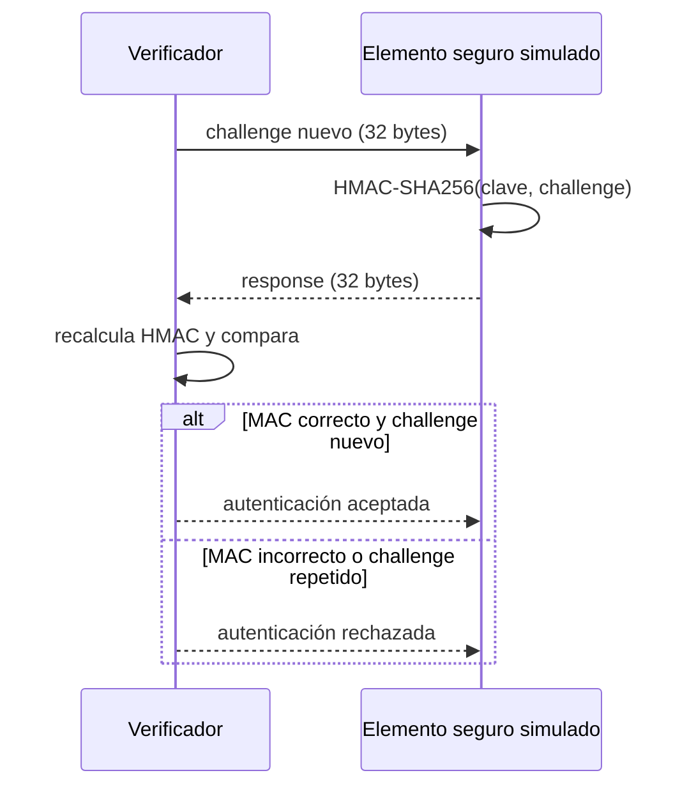

# Ejercicio 11 — Autenticación challenge–response en GD32VW553

**Autora:** Laura Daniela Barragán Silva  
**Plataforma:** GD32VW553HMQ6/HMQ7, RISC-V RV32  
**Entorno:** Visual Studio Code, CMake, Ninja, Nuclei GCC/GDB y OpenOCD

## Propósito

Este laboratorio simula un elemento seguro inspirado en dispositivos como el
ATECC608. El microcontrolador ejecuta cinco pruebas de autenticación con
HMAC-SHA256 y permite observar cómo se aceptan credenciales válidas y se
rechazan alteraciones y repeticiones.

> Este proyecto es didáctico. La clave está incluida en el firmware y puede
> extraerse; por tanto, **no ofrece la protección física de un ATECC608 real**.
> Tampoco implementa criptografía de curva elíptica ni toda su API.

## Flujo de autenticación



## Pruebas automáticas

| Paso | Prueba | Resultado esperado |
|---:|---|---|
| 0 | Challenge y respuesta válidos | Aceptada |
| 1 | Challenge alterado con respuesta anterior | MAC rechazado |
| 2 | Respuesta alterada en tránsito | MAC rechazado |
| 3 | Segundo challenge válido | Aceptada |
| 4 | Repetición del par válido anterior | Replay rechazado |

El LED PC13 muestra dos destellos cortos para una aceptación y uno largo para
un rechazo. La validación precisa se realiza con el depurador.

## Uso desde VS Code

1. Copie `tools/local_config.example.ps1` como `tools/local_config.ps1` y
   configure las tres rutas locales.
2. Abra esta carpeta como raíz en VS Code y confíe en ella.
3. Use `Terminal > Run Task`:
   - `1. Verificar entorno GD32`
   - `6. Preparar depuración`
   - `5. Compilar y programar GD32`
4. Abra *Run and Debug*, seleccione
   `Debug GD32VW553 - Secure Element` e inicie la sesión.

## Valores esperados al completar un ciclo

Detenga el programa en `g_sequence_cycles++;`:

```text
g_authentication_accepted                 = 2
g_authentication_rejected                 = 3
g_expected_mac_failures                   = 2
g_expected_replays                        = 1
g_secure_element.commands_executed        = 3
g_auth_verifier.verification_attempts     = 5
g_auth_verifier.accepted                  = 2
g_auth_verifier.rejected_mac              = 2
g_auth_verifier.rejected_replay           = 1
```

## Documentación

- [Preparación](Doc/1_SETUP.md)
- [Compilación y programación](Doc/2_BUILD_AND_FLASH.md)
- [Conceptos y preguntas](Doc/3_CONCEPTS_AND_QUESTIONS.md)
- [Depuración](Doc/4_DEBUGGING.md)
- [Solución de problemas](Doc/5_TROUBLESHOOTING.md)
- [Laboratorio guiado](Doc/6_GUIDED_LAB.md)
- [Recorrido del código](Doc/7_CODE_WALKTHROUGH.md)
- [Glosario](Doc/8_GLOSSARY.md)

El SDK oficial, el compilador y OpenOCD son dependencias externas y no se
incluyen en el repositorio. `build/`, `tools/local_config.ps1` y
`.vscode/launch.json` también se excluyen porque son archivos locales.
